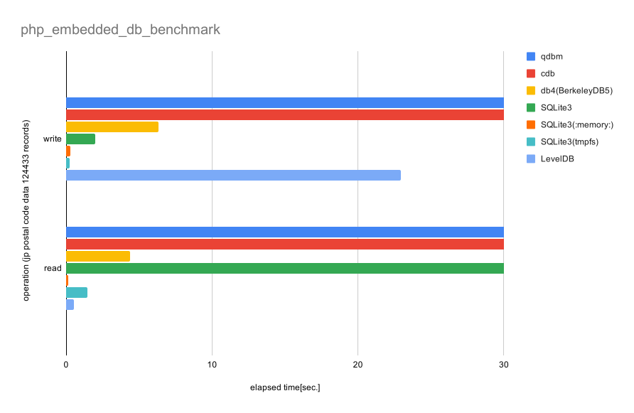

# embedded_db_bench
performance comparison of embedded databases in php.

benchmark result
-------------------

  
smaller is better.  
PHP=7.4.3  

||qdbm|cdb|db4(BerkeleyDB5)|SQLite3|SQLite3(:memory:)|SQLite3(tmpfs)|LevelDB|
|--|--|--|--|--|--|--|--|
|write|155.591542|98.49904013|6.337472916|1.99793601|0.3023738861|0.2330839634|22.959782123566|
|read|156.201859|180.304518|4.378100872|327.5866439|0.1585948467|1.440153122|0.5493938923|
  

how to run benchmark
-------------------

# prepare test data

```
# download jp postal code list for test data
bash dl_data.sh
bash csv2json.sh
```

# start benchmark

`php dba_bench_rw.php <handler type> <test operations>`

* handler type  
supported handler name in your environment.  
'all' as all supported handler types.  
see `php -r 'var_dump(dba_handlers());'`

* test operations  
r = read test  
w = write test only  
rw = read test after write test  


e.g.
```
# read/write test all handler type
php dba_bench_rw.php all rw

# read test db4
php dba_bench_rw.php db4 r

# write test cdb
php dba_bench_rw.php cdb w

```

