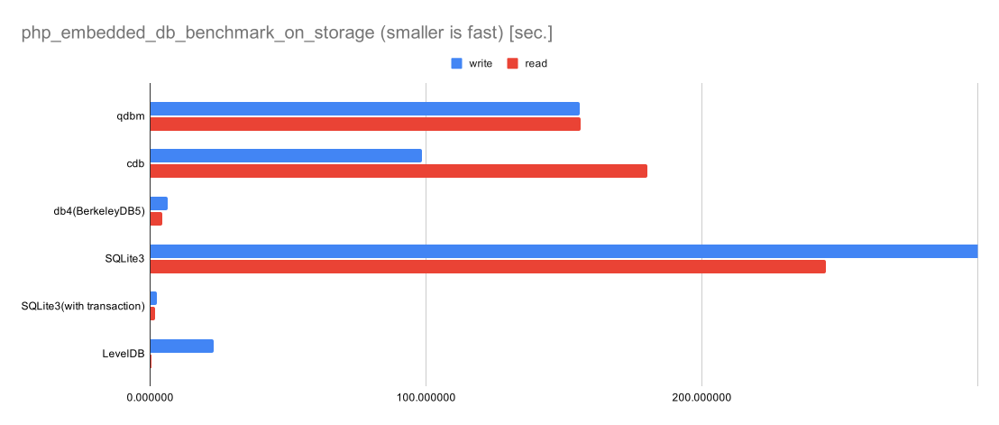
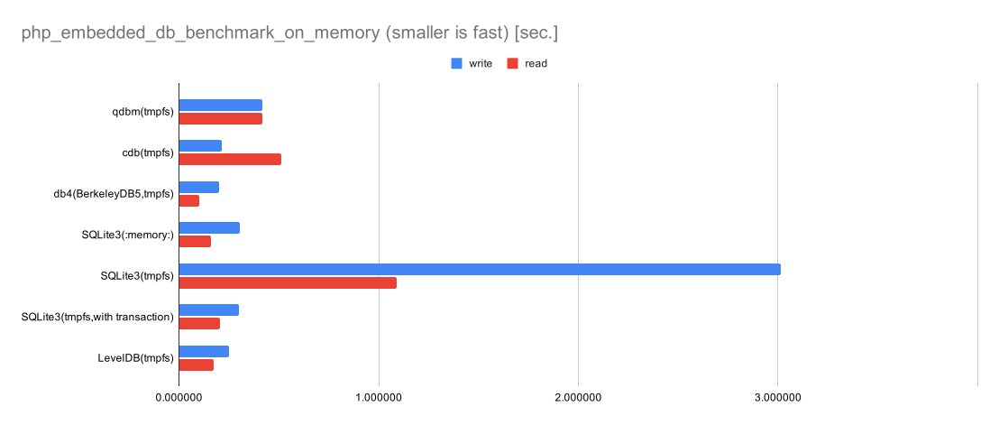

# embedded_db_bench
performance comparison of embedded databases in php.

benchmark result
-------------------


smaller is better.  
PHP=7.4.3  

  

### On Storage  

|	|write|	read|
|--|--|--|
|qdbm|	155.591542|	156.201859|
|cdb|	98.499040|	180.304518|
|db4(BerkeleyDB5)|	6.337473|	4.378101|
|SQLite3|	1.997936|	327.586644|
|LevelDB|	22.959782|	0.549394|


  


### On Memory

|   |write|read|
|--|--|--|
|qdbm(tmpfs)|0.418172|0.418172|
|cdb(tmpfs)|0.215480|0.512907|
|db4(BerkeleyDB5,tmpfs)|0.201170|0.103114|
|SQLite3(:memory:)|0.302374|0.158595|
|SQLite3(tmpfs)|0.233084|1.440153|
|LevelDB(tmpfs)|0.249419|0.172687|


  


how to run benchmark
-------------------

# prepare test data

```
# download jp postal code list for test data
bash dl_data.sh
bash csv2json.sh
```

# start benchmark

`php dba_bench_rw.php <handler type> <test operations>`

* handler type  
supported handler name in your environment.  
'all' as all supported handler types.  
see `php -r 'var_dump(dba_handlers());'`

* test operations  
r = read test  
w = write test only  
rw = read test after write test  


e.g.
```
# read/write test all handler type
php dba_bench_rw.php all rw

# read test db4
php dba_bench_rw.php db4 r

# write test cdb
php dba_bench_rw.php cdb w

```

